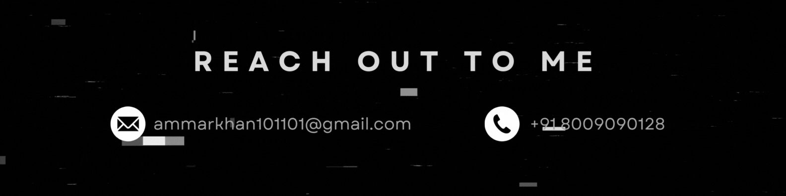

<!--  -->

<h1 align="center">
Hello World! I am Ammar Khan 
</h1>

I'm an **aspiring Software Developer** and **Data Science enthusiast** passionate about turning ideas into code and insights into solutions. I enjoy exploring **web development**, **data analysis**, and **problem-solving** with Python, JavaScript, and SQL.

Beyond tech, I love expressing creativity through **photography**, **calligraphy**, **poetry**, and **sketching**. I believe combining logic with creativity opens new perspectives in both coding and life.

    
  
  
  
  

