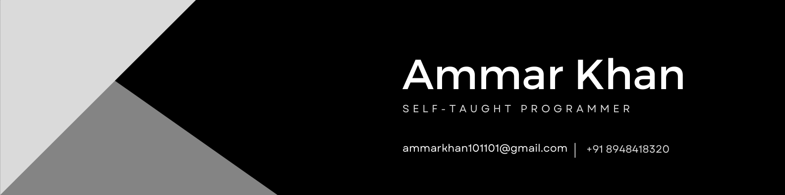

Hi there I am Ammar-Khan 

## Here are some ideas to get you started:

- 🔭 I’m currently working on [Clock as Wallpaper](http://ammar-khan.netlify.com/)
- 🌱 I’m currently learning **Tailwind.css**
- 💬 Ask me about **Calligraphy**
- ⚡ Fun fact: My first line of code was not "Hello World!"

## Framworks and other libraries

  

## Follow me

---